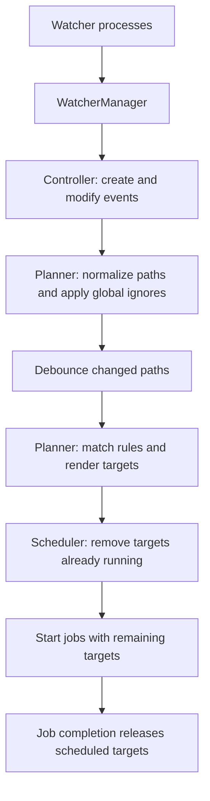

# Plur Watch Architecture

`plur watch` combines embedded watcher processes with a Go controller that maps
file changes to jobs. See [Watch Mode](../features/watch-mode.md) for usage and
[Watch Configuration](../configuration.md#watch-configuration) for mapping syntax.

## Components

| Component | Responsibility |
|-----------|----------------|
| `cmd_watch.go` | Builds the planner, filters watch directories, and configures the controller |
| `internal/watch/watcher_manager.go` | Starts watchers and combines their events and errors |
| `internal/watch/watcher.go` | Manages one embedded C++ watcher process and reads its JSON events |
| `internal/watch/controller.go` | Handles events, interactive commands, job completion, timeout, and signals |
| `internal/watch/plan.go` | Filters paths and maps changed files to job targets; also used by `plur watch find` |
| `internal/watch/debouncer.go` | Batches and deduplicates paths, with a default 30ms delay |
| `internal/watch/scheduler.go` | Tracks active jobs and skips targets already running in the same job |
| `internal/watch/execute.go` | Builds commands, starts child jobs, streams output, and waits for processes to exit |

## Event Flow

The planner rejects paths outside the project and paths matching global ignore
patterns. It expands target templates, skips targets missing on disk, removes
duplicates, and groups targets by job.

Independent runs execute concurrently. An active target only blocks the same
target in the same job. Runs without targets only block other runs without
targets in that job. Child stdout and stderr go directly to the terminal, so
concurrent output can interleave.

## Watcher Processes

The embedded watcher monitors directories recursively. Before starting one
process per directory, Plur checks that each directory is within the project,
removes paths that resolve to the same directory, and skips subdirectories
already covered by a parent. For example, `[., lib, spec]` becomes `[.]`, while `[lib, spec, app]` remains three
separate watchers.

Watcher binaries live under `internal/embedded/watcher/` and are embedded at
compile time. `bin/rake build` downloads the current platform's binary;
`bin/rake build:all` downloads all supported binaries. At runtime they are
extracted to `$PLUR_HOME/bin/` and replaced when the bundled version changes.
See [Platform Support](../features/watch-mode.md#platform-support).

## Shutdown and Reload

The controller tracks direct child jobs and waits for them to exit. The first
terminal Ctrl-C stops new work and waits for active jobs; a second force-stops
them. Without a terminal, SIGINT uses a short grace period before stopping
remaining jobs. Timeout, `exit`, and SIGTERM also clean up active jobs and
watcher processes.

`reload` and SIGHUP stop active work and watchers, restore terminal state, and
re-exec Plur with the same arguments. SIGKILL cannot run cleanup and may leave
child jobs running.
