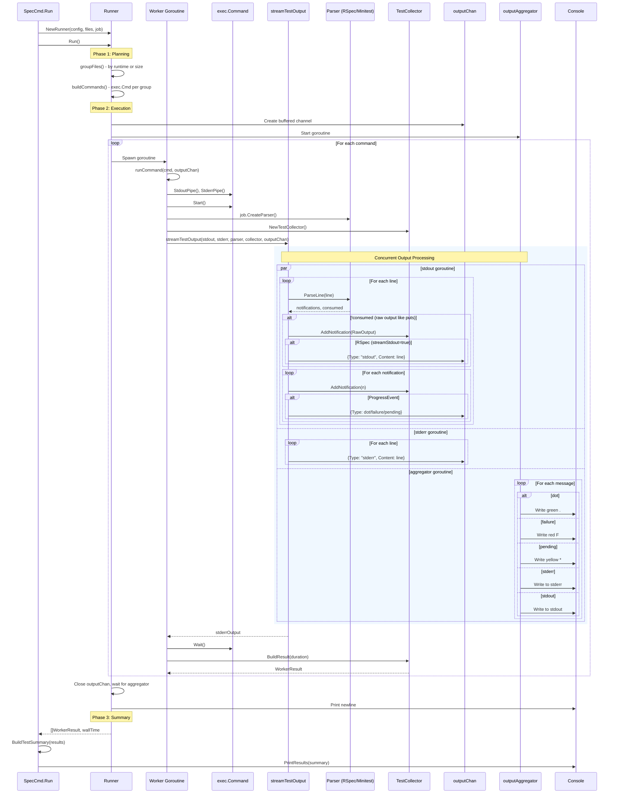

# Test Processing Flow

This document provides a comprehensive view of how Plur processes test output, from the runner through all components including the parser, collector, and output aggregator.

The architecture is framework-agnostic: RSpec and Minitest use the same flow with framework-specific parsers.

## Full System Flow - Test Execution

## Key Components

### 1. **Runner** (runner.go)
Orchestrates the entire test execution:
* `Run()` - Entry point with three phases: planning, execution, results
* `groupFiles()` - Groups files by runtime data (preferred) or file size (fallback)
* `buildCommands()` - Creates `exec.Cmd` for each file group with framework-specific args
* `executeWorkers()` - Spawns worker goroutines, manages channels, waits for completion
* `runCommand()` - Runs a single command: pipes, parser, collector, streamTestOutput

### 2. **streamTestOutput** (stream_helper.go)
Handles real-time output processing with two concurrent goroutines:
* **stdout goroutine**: Parses lines via `parser.ParseLine()`, sends progress to `outputChan`, collects raw output
  * For RSpec: Also streams unconsumed stdout (puts/pp) in real-time via `outputChan`
  * For Minitest: Raw stdout is collected but NOT streamed (Minitest returns consumed=false for all lines)
* **stderr goroutine**: Passes through to `outputChan` with type "stderr"

### 3. **Parser** (rspec/ or minitest/)
Framework-specific output parsing:
* `ParseLine(line)` returns `(notifications, consumed)`
* Emits `ProgressEvent` for dots/failures, `TestCaseNotification` for test results
* `FormatSummary()` for framework-native summary output

### 4. **TestCollector** (test_collector.go)
Accumulates notifications from parser:
* Tracks tests, failures, pending counts
* Stores raw output in `rawOutput` string builder
* `BuildResult()` creates final `WorkerResult`

### 5. **outputAggregator** (runner.go)
Single goroutine that serializes all output:
* Reads from `outputChan`
* Writes colored progress indicators (., F, *) to stdout
* Writes raw stdout (puts/pp output) to stdout (RSpec only)
* Writes stderr lines to stderr

### 6. **PrintResults** (result.go)
Displays final summary:
* `BuildTestSummary()` aggregates all WorkerResults
* Framework-aware formatting via `parser.FormatSummary()`
* Shows failures, then summary line

## Architecture Highlights

* **Framework-agnostic flow**: Same Runner/streaming for RSpec and Minitest
* **Channel-based output**: No lock contention, single aggregator serializes output
* **Event-based parsing**: Parsers emit typed notifications, not raw strings
* **Unified WorkerResult**: Each worker returns one result covering multiple test files