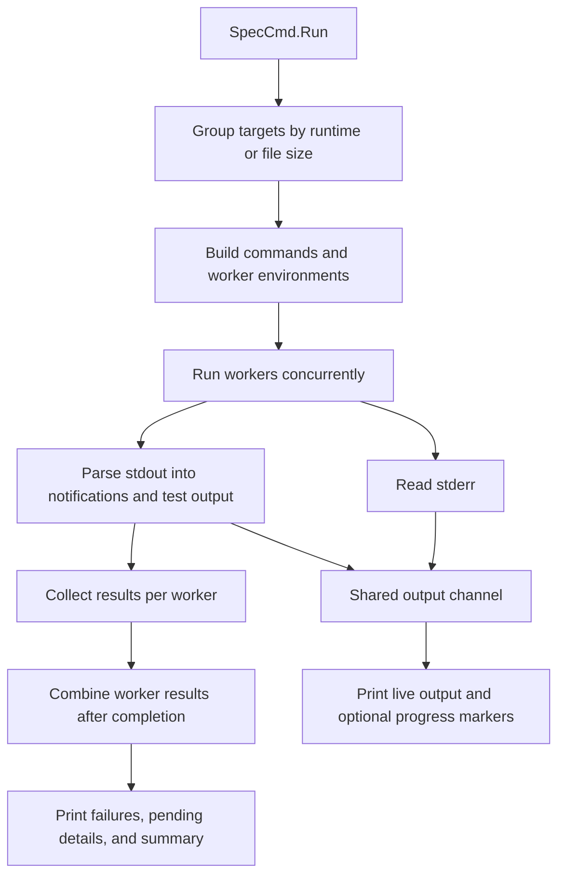

# Test Processing Flow

RSpec and Minitest use the same runner with framework-specific parsers. Job
selection and command construction are described in [Jobs and Frameworks](runner-jobs-framework.md).

```mermaid
flowchart TD
    CLI[SpecCmd.Run] --> Plan[Group targets by runtime or file size]
    Plan --> Commands[Build commands and worker environments]
    Commands --> Workers[Run workers concurrently]
    Workers --> Stdout[Parse stdout into notifications and test output]
    Workers --> Stderr[Read stderr]
    Stdout --> Collector[Collect results per worker]
    Stdout --> Channel[Shared output channel]
    Stderr --> Channel
    Channel --> Aggregator[Print live output and optional progress markers]
    Collector --> Results[Combine worker results after completion]
    Results --> Summary[Print failures, pending details, and summary]
```

## Execution

`internal/runner/runner.go` groups targets using recorded runtimes, falling back
to file sizes. It builds one command per group and starts a goroutine for each
worker. A dry run prints the commands without starting workers.

Each worker creates its own framework parser and `TestCollector`, drains stdout
and stderr, then waits for the process and records its exit status. RSpec workers
must also report suite completion. See [Exit Status](../usage.md#exit-status) for
how worker errors affect the command's exit code.

## Live Output

`internal/runner/stream_helper.go` reads stdout and stderr concurrently:

* The parser converts structured stdout rows into notifications. The collector
  accumulates test results and suite counts, while progress events enter the
  shared output channel.
* Test-written stdout streams live for both RSpec and Minitest. Unconsumed lines
  are not stored for later printing, which avoids duplicate output.
* Test output extracted from a structured row also streams live.
* Stderr goes directly to the output channel.

A single `outputAggregator` goroutine serializes writes. It prints test output
to stdout and stderr to stderr. Progress markers (`.`, `F`, `*`, `E`) appear only
with the `progress` formatter; color is controlled independently. See
[Output Formats](../usage.md#output-formats).

## Results

`internal/runner/test_collector.go` builds each `WorkerResult` from notifications.
It retains framework diagnostic output for reporting errored workers, alongside
test results and suite counts.

After workers finish and the output channel drains, `SpecCmd.Run` combines their
results through `internal/runner/result.go`. Final output uses the framework's
summary format and includes failure details and RSpec rerun commands where
applicable. Successful runs with examples update the
[runtime cache](../usage.md#runtime-tracking).
