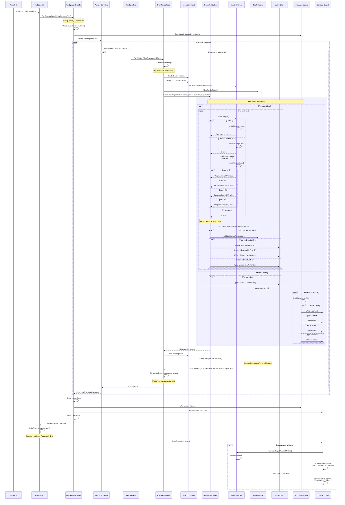

# Minitest Flow Sequence Diagram

This document provides a comprehensive view of how Plur processes Minitest test output, from the runner through all components including the parser, collector, and output aggregator.

**Updated**: Reflects current architecture with WorkerResult, ProgressEvent, unified test representation, and framework-aware formatting.

## Full System Flow - Minitest Execution

!!! tip "Viewing Large Diagrams"
    This diagram supports pan and zoom! Use your mouse wheel to zoom in/out and drag to pan around. Double-click to reset the view.

## Key Components

### 1. **RunSpecsInParallel**
- Groups test files by runtime or size
- Creates output channel for progress updates
- Launches worker goroutines
- Starts output aggregator

### 2. **Worker Goroutines**
- Each worker processes a group of files
- Calls RunSpecFile which dispatches to framework-specific runner

### 3. **RunMinitestFiles**
- Builds minitest command (`ruby -Itest ...`)
- Creates pipes for stdout/stderr
- Instantiates parser and collector
- Calls streamTestOutput

### 4. **streamTestOutput (stream_helper.go)**
- Runs two concurrent goroutines:
  - One for stdout (parsing)
  - One for stderr (pass-through)
- Always preserves raw output as OutputNotification
- Sends progress indicators to outputChan

### 5. **MinitestParser (minitest/output_parser.go)**
- State machine with multiple states (parsingProgress, afterFinished, inFailureDetails)
- Emits ProgressEvent for real-time display (., F, E, S)
- Parses failure details after test execution
- Creates complete TestCaseNotification objects with failure information
- Implements FormatSummary for framework-specific output

### 6. **TestCollector**
- Accumulates all notifications
- Separates progress tracking from test results
- Stores complete TestCaseNotification objects
- Stores raw output lines
- BuildResult creates final WorkerResult with framework context

### 7. **outputAggregator**
- Reads from outputChan
- Writes colored progress indicators to console
- Handles stderr output
- Runs concurrently with test execution

### 8. **PrintResults (result.go)**
- Framework-aware formatting
- Uses parser.FormatSummary for framework-specific output
- Minitest shows: "X runs, Y assertions, Z failures, W errors, V skips"
- RSpec shows: "X examples, Y failures"
- Falls back to generic formatting if parser unavailable

## Key Improvements Since Initial Implementation

1. **Framework Context Preserved**: WorkerResult and TestSummary include Framework field
2. **Unified Test Representation**: Single TestCaseNotification type for all test results
3. **Progress Events**: Separate ProgressEvent type for real-time display without duplication
4. **Framework-Aware Formatting**: PrintResults uses parser.FormatSummary for native output
5. **Complete Failure Parsing**: Minitest parser extracts full failure details
6. **Better Naming**: TestResult renamed to WorkerResult to clarify it represents multiple files from one worker

## Current Architecture Highlights

1. **Event-Based Design**: Clean separation between parsing, accumulation, and display
2. **Parser Factory Pattern**: Framework-specific parsers created via factory
3. **Shared Streaming Logic**: Common output streaming for both frameworks
4. **Tell Don't Ask**: Parsers tell the runner how to format output
5. **No Type Proliferation**: Eliminated redundant TestFailure type