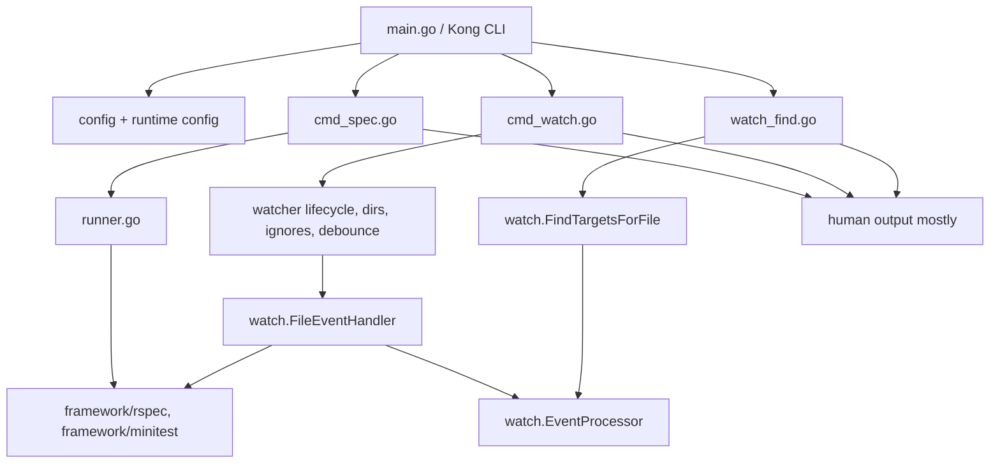
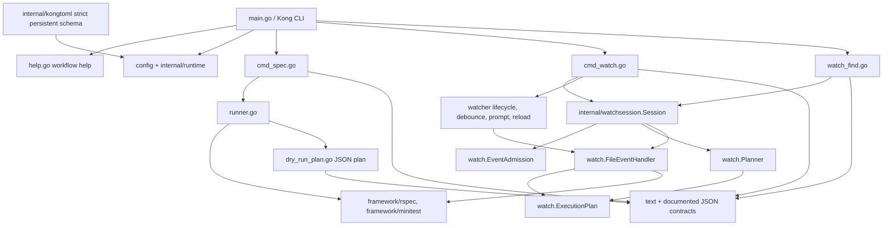
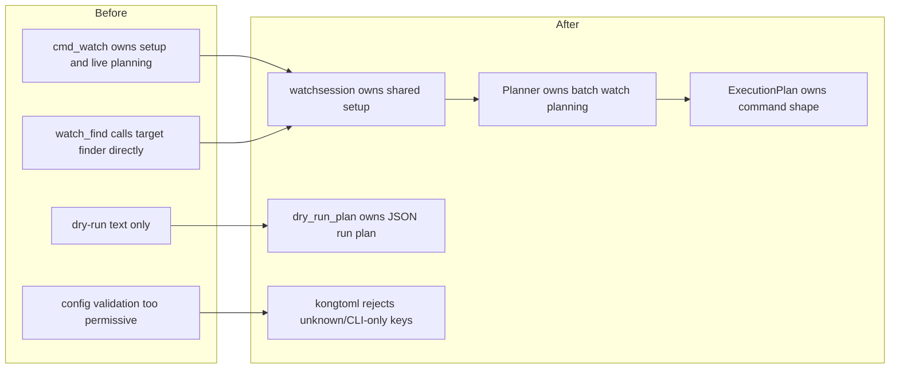

# Codebase Structure Comparison

## Summary

The CLI-UX work did not rewrite Plur. It changed the shape of the command
surface by adding clearer edge behavior and pulling shared planning code out of
duplicated command paths.

The most important structural change is watch mode:

- Before: live watch and `watch find` each owned too much of job selection,
  target planning, and command construction.
- After: both paths share `internal/watchsession`, `watch.Planner`, and
  `watch.ExecutionPlan`.

## BEFORE: `v0.56.0`

### Before Notes

- Top-level help was command-first even though commandless `plur` was common.
- Dry-run output was human text and did not explain selected job/reason.
- `watch find` used lower-level target-finding behavior rather than the live
  watch planning boundary.
- Config validation was too permissive for unknown keys and CLI-only settings.
- The old `--json` flag was not a clean output contract.

## AFTER: `v0.60.0-rc.1`

### After Notes

- Help is explicitly workflow-oriented and mode-specific.
- One-shot dry-run JSON is generated after runner command planning.
- Watch preview JSON is generated after shared watch planning.
- `watch find` and live watch share runtime config, admission, planning, and
  command shape.
- Config schema is stricter and rejects unknown or CLI-only keys.
- Output contracts are documented in `docs/output-contracts.md`.

## Direct Structural Comparison

## Key New Or Strengthened Modules

| Area | Files | Purpose |
| --- | --- | --- |
| Help shaping | `help.go`, help specs | Keep first-contact CLI surfaces workflow-oriented. |
| Dry-run JSON | `dry_run_plan.go`, runner dry-run plan code | Versioned one-shot command plan. |
| Watch session | `internal/watchsession/session.go` | Shared watch setup/admission/planning facade. |
| Watch planner | `watch/planner.go` | Pure planning from changed files to jobs/targets/errors. |
| Execution plan | `watch/execution_plan.go` | Shared argv/env/cwd/targets command shape. |
| Event admission | `watch/event_admission.go` | Shared ignored/unsupported event filtering. |
| Config validation | `internal/kongtoml/kongtoml.go` | Strict persistent config schema. |
| Output contracts | `docs/output-contracts.md` | Stable reference for streams, JSON, and exit codes. |

## Structural Risks

- Help customization now depends on keeping Kong help filtering and parser
  behavior aligned.
- `internal/kongtoml` is stricter, but nested schema fields still partly derive
  from runtime structs.
- `cmd_watch.go` remains a large orchestration file because lifecycle concerns
  correctly stay at the command edge.
- Internal goal docs are excluded from MkDocs but still live under `docs/`.
