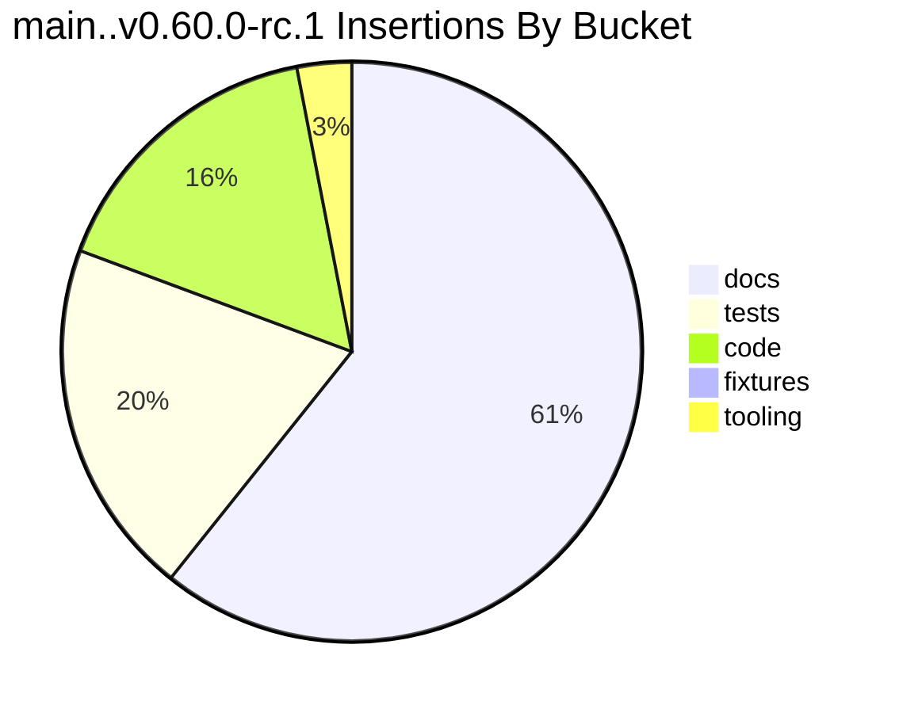

# CLI-UX Goal Metrics

## Summary

The CLI-UX release candidate is a large change set dominated by documentation
and tests. The codebase grew because it gained explicit output contracts,
stricter config validation, watch planning/session abstractions, and many
integration guardrails.

Measured headline:

- `v0.56.0..v0.60.0-rc.1`: 148 files changed, 15,152 insertions, 1,222
  deletions.
- `main..v0.60.0-rc.1`: 113 files changed, 11,606 insertions, 957 deletions.
- `cloc` code lines grew from 32,115 to 43,501 between `v0.56.0` and
  `v0.60.0-rc.1`.
- Fresh static checks on both extracted versions passed: `go test`, `go vet`,
  and `standardrb`.
- Small fixture dry-run benchmark was effectively unchanged.
- Small fixture one-spec execution benchmark showed `v0.60.0-rc.1` around 9%
  slower than `v0.56.0`; treat this as a narrow fixture result.

Raw artifacts are in [artifacts/](artifacts/README.md).

## Ref Baselines

| Ref | Object / Commit | Note |
| --- | --- | --- |
| `v0.56.0` | tag object `6659c398`, commit `9662fd23` | Original requested baseline. |
| `main` | `3feb1146` | Cleaner CLI-UX-specific baseline. |
| `v0.60.0-rc.1` | tag object `60523f62`, commit `d39385cd` | Release-candidate outcome. |
| `prep-goal` at assessment start | `f867bc4c` | One docs-prep commit beyond RC. |

## Main Baseline CLI Captures

The assessment also built a `main` binary from a git archive and captured the
same high-signal CLI surfaces:

- [main top-level help](artifacts/main-help.stdout.txt)
- [main watch help](artifacts/main-watch-help.stdout.txt)
- [main dry-run JSON stderr](artifacts/main-dry-run-json.stderr.txt)
- [main watch-find JSON stderr](artifacts/main-watch-find-json.stderr.txt)

The main binary confirms that the focused CLI-UX surfaces were not present
before the RC:

- top-level help is command-first;
- `--dry-run-format=json` is an unknown flag;
- `watch find --format=json` is an unknown flag.

## Git Diff Size

From [artifacts/git-diff-shortstat-v0.56-to-v0.60rc1.txt](artifacts/git-diff-shortstat-v0.56-to-v0.60rc1.txt):

```text
148 files changed, 15152 insertions(+), 1222 deletions(-)
```

Cleaner CLI-UX delta from `main..v0.60.0-rc.1`:

```text
113 files changed, 11606 insertions(+), 957 deletions(-)
```

Bucketed `main..v0.60.0-rc.1` diff:

| Bucket | Files | Insertions | Deletions |
| --- | ---: | ---: | ---: |
| docs | 40 | 7,038 | 510 |
| tests | 38 | 2,310 | 102 |
| code | 25 | 1,888 | 332 |
| fixtures | 6 | 17 | 13 |
| tooling | 4 | 353 | 0 |



## Line Counts By Language

`cloc` summaries:

| Language | v0.56.0 files | v0.56.0 code | v0.60.0-rc.1 files | v0.60.0-rc.1 code | Code delta |
| --- | ---: | ---: | ---: | ---: | ---: |
| Markdown | 54 | 10,419 | 83 | 16,389 | +5,970 |
| Go | 79 | 10,433 | 100 | 14,225 | +3,792 |
| Ruby | 179 | 8,475 | 195 | 10,074 | +1,599 |
| YAML | 25 | 856 | 25 | 873 | +17 |
| Bash | 11 | 677 | 11 | 685 | +8 |
| TOML | 16 | 161 | 16 | 159 | -2 |
| Total | 389 | 32,115 | 455 | 43,501 | +11,386 |

```mermaid
xychart-beta
  title "Code Lines By Major Language"
  x-axis ["Markdown", "Go", "Ruby", "Other"]
  y-axis "Code lines" 0 --> 17000
  bar [10419, 10433, 8475, 2788]
  bar [16389, 14225, 10074, 2813]
```



## Static Analysis And Test Signals

Static checks were run against git-archive extracts of both versions.

| Version | `go test -mod=mod ./...` | `go vet -mod=mod ./...` | `bundle exec standardrb` |
| --- | ---: | ---: | ---: |
| `v0.56.0` | 0 | 0 | 0 |
| `v0.60.0-rc.1` | 0 | 0 | 0 |

Exit-code artifacts:

- [static-v056-go-test.exit.txt](artifacts/static-v056-go-test.exit.txt)
- [static-v056-go-vet.exit.txt](artifacts/static-v056-go-vet.exit.txt)
- [static-v056-standardrb.exit.txt](artifacts/static-v056-standardrb.exit.txt)
- [static-v060-go-test.exit.txt](artifacts/static-v060-go-test.exit.txt)
- [static-v060-go-vet.exit.txt](artifacts/static-v060-go-vet.exit.txt)
- [static-v060-standardrb.exit.txt](artifacts/static-v060-standardrb.exit.txt)

Historical full-gate evidence from the completed CLI-UX goal:

- T74 recorded `bin/rake` passing with 386 examples, 0 failures, and 4 pending.
- T75 recorded `script/check-links` passing.

Assessment caveat: this metrics pass did not rerun `bin/rake` on the full
current working tree because the current task is documentation-only and the
versioned static checks plus existing T74/T75 gates are sufficient for outcome
analysis. The final assessment verification does run docs validation.

## Whitespace Check

`git diff --check main..v0.60.0-rc.1` exits 2 because historical internal goal
docs contain trailing whitespace:

- `docs/goal/cli_goal.md`
- `docs/goal/tx_score_card.md`

See [artifacts/git-diff-check-main-to-v0.60rc1.txt](artifacts/git-diff-check-main-to-v0.60rc1.txt).

This is not product behavior risk, but it is process hygiene evidence.

## CLI Behavior Metrics

Captured CLI outputs show new structured surfaces:

| Surface | v0.56.0 | v0.60.0-rc.1 |
| --- | --- | --- |
| Top-level help | Command-first help. | Commandless usage plus common workflows. |
| Watch help | Includes one-shot run flags. | Watch-focused help; run-only flags hidden. |
| Dry-run text | Worker commands only. | Selected job, plan summary, no-run statement, commands. |
| Dry-run JSON | Unknown flag. | Versioned JSON plan. |
| Watch-find JSON | Unknown flag. | Versioned JSON preview with command plans. |

`main` matches the older shape for the key CLI-UX surfaces: command-first help,
unknown `--dry-run-format`, and unknown watch-find `--format`.

## Benchmark Results

Benchmarks were run with `hyperfine` against locally built binaries from git
archives. The fixture bundle was installed before one-spec execution timing.

Dry-run benchmark:

| Command | Mean | Range | Relative |
| --- | ---: | ---: | ---: |
| `v0.56.0 default-ruby dry-run` | 3.7 ms +/- 0.9 | 3.2..5.2 ms | 1.01 +/- 0.27 |
| `v0.60.0-rc.1 default-ruby dry-run` | 3.6 ms +/- 0.4 | 3.1..4.2 ms | 1.00 |

One-spec fixture benchmark:

| Command | Mean | Range | Relative |
| --- | ---: | ---: | ---: |
| `v0.56.0 default-ruby one spec` | 167.5 ms +/- 4.8 | 162.2..171.8 ms | 1.00 |
| `v0.60.0-rc.1 default-ruby one spec` | 182.2 ms +/- 9.5 | 172.0..193.2 ms | 1.09 +/- 0.06 |

Interpretation:

- Dry-run overhead did not meaningfully regress in this small benchmark.
- One-spec execution was slower in this tiny fixture by about 9%.
- This does not prove broad runtime regression. It does mean release claims
  should avoid "same or better performance" unless larger benchmarks are run.

## Documentation And Process Volume

Measured current repository directories:

| Path | Size / Count |
| --- | ---: |
| `docs/goal` | 312K |
| `docs/goal` files | 23 |
| `docs/goal-assessment/artifacts` | 316K |
| `docs/goal-assessment/artifacts` files before synthesis | 81 |

Interpretation: the process generated unusually strong traceability but also a
large amount of internal documentation.

## Recommended Follow-Up Metrics

Before final publication or release announcement:

```bash
bin/rake
script/check-links
script/cli-inventory
script/bench-git --refs v0.56.0 main v0.60.0-rc.1 --project fixtures/projects/default-ruby --runs 10 --warmup 2 --workers 4 --cleanup
script/bench-git --refs v0.56.0 main v0.60.0-rc.1 --project ~/src/oss/rubocop --runs 5 --warmup 2 --workers 8 --ignore-failure --cleanup
```

Use the larger benchmark before making broad performance claims.
