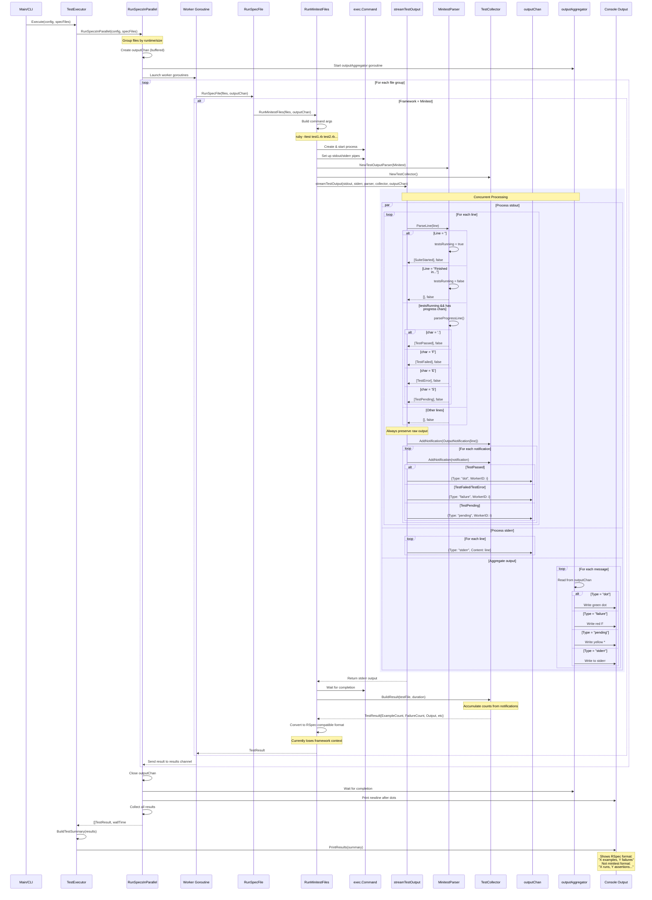

# Minitest Flow Sequence Diagram

This document provides a comprehensive view of how Rux processes Minitest test output, from the runner through all components including the parser, collector, and output aggregator.

## Full System Flow - Minitest Execution

!!! tip "Viewing Large Diagrams"
    This diagram supports pan and zoom! Use your mouse wheel to zoom in/out and drag to pan around. Double-click to reset the view.

## Key Components

### 1. **RunSpecsInParallel**
- Groups test files by runtime or size
- Creates output channel for progress updates
- Launches worker goroutines
- Starts output aggregator

### 2. **Worker Goroutines**
- Each worker processes a group of files
- Calls RunSpecFile which dispatches to framework-specific runner

### 3. **RunMinitestFiles**
- Builds minitest command (`ruby -Itest ...`)
- Creates pipes for stdout/stderr
- Instantiates parser and collector
- Calls streamTestOutput

### 4. **streamTestOutput (stream_helper.go)**
- Runs two concurrent goroutines:
  - One for stdout (parsing)
  - One for stderr (pass-through)
- Always preserves raw output as OutputNotification
- Sends progress indicators to outputChan

### 5. **MinitestParser (minitest/output_parser.go)**
- Simple state machine with `testsRunning` flag
- Parses progress indicators (., F, E, S)
- Always returns `consumed=false` to preserve output
- Missing: Never calls `parseSummaryLine`

### 6. **TestCollector**
- Accumulates all notifications
- Tracks counts (passed, failed, pending)
- Stores raw output lines
- BuildResult creates final TestResult

### 7. **outputAggregator**
- Reads from outputChan
- Writes colored progress indicators to console
- Handles stderr output
- Runs concurrently with test execution

### 8. **PrintResults (result.go)**
- Formats final summary
- Currently hardcoded to RSpec style
- Doesn't know which framework was used
- Missing: Framework-aware formatting

## Current Issues

1. **Framework Context Lost**: By the time we reach PrintResults, we don't know if tests were RSpec or Minitest
2. **Summary Line Not Parsed**: The minitest summary ("X runs, Y assertions...") is captured but not parsed
3. **Output Format**: Always shows RSpec style regardless of framework
4. **TestError Handling**: TODO comment indicates uncertainty about 'E' indicator handling

## Potential Solutions

1. Add Framework field to TestResult or TestSummary
2. Call parseSummaryLine when appropriate
3. Make PrintResults framework-aware
4. Store and display raw minitest output for authentic experience