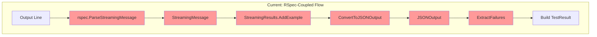

# Old Runner Analysis: Decoupling RSpec Logic

## Current State: Heavy RSpec Coupling in Runner

Looking at `RunRSpecFiles` in runner.go (lines 185-398), we have significant RSpec-specific logic embedded:

```go
// RSpec-specific accumulator
streamingResults := &rspec.StreamingResults{}

// RSpec-specific parsing
msg, err := rspec.ParseStreamingMessage(line)

// RSpec-specific message types
switch msg.Type {
case "load_summary":
case "example_passed":
case "example_failed":
case "dump_failures":
// etc...
}

// RSpec-specific conversion
jsonOutput := streamingResults.ConvertToJSONOutput()
rspecFailures := rspec.ExtractFailures(jsonOutput.Examples)
failures := convertRSpecFailures(testFile, rspecFailures)
```

## The Core Problem

We're doing **four distinct operations** that are all coupled to RSpec:

1. **Parsing**: Converting output lines to structured messages
2. **Accumulating**: Collecting events/results during execution  
3. **Converting**: Transforming accumulated data to a common format
4. **Building**: Creating the final TestResult

These should be **generic operations** with **framework-specific implementations**.

## Current Flow Diagram



## Proposed Generic Abstraction

### Core Types

```go
// Generic test execution event
type TestEvent interface {
    GetType() TestEventType
    GetTestID() string  // Unique identifier for the test
}

type TestEventType string

const (
    EventTestStarted   TestEventType = "test_started"
    EventTestPassed    TestEventType = "test_passed"
    EventTestFailed    TestEventType = "test_failed"
    EventTestPending   TestEventType = "test_pending"
    EventTestError     TestEventType = "test_error"
    EventSuiteStarted  TestEventType = "suite_started"
    EventSuiteFinished TestEventType = "suite_finished"
    EventOutput        TestEventType = "output"
)

// Concrete event types
type TestStartedEvent struct {
    TestID      string
    Description string
    Location    string
}

type TestPassedEvent struct {
    TestID   string
    Duration time.Duration
}

type TestFailedEvent struct {
    TestID      string
    Duration    time.Duration
    Message     string
    Backtrace   []string
    Actual      string
    Expected    string
}

type SuiteStartedEvent struct {
    TestCount int
    LoadTime  time.Duration
}
```

### Framework Interfaces

```go
// Parses output lines into test events
type TestOutputParser interface {
    // Parse a line of output, returns events and whether to continue parsing this line
    ParseLine(line string) ([]TestEvent, bool)
    
    // Called when output is complete
    Finish() []TestEvent
}

// Accumulates events during test execution
type TestEventAccumulator interface {
    AddEvent(event TestEvent)
    GetSummary() TestExecutionSummary
    GetFailures() []TestFailure
    GetTestCount() int
    GetFailureCount() int
    GetDuration() time.Duration
}

// Builds final test results
type TestResultBuilder interface {
    BuildResult(accumulator TestEventAccumulator, output string, err error) TestResult
}
```

## Proposed Flow Diagram

```mermaid
graph TD
    subgraph "Proposed: Generic Flow"
        OUT[Output Line] --> PARSER{TestOutputParser}
        PARSER --> EVENTS[[]TestEvent]
        EVENTS --> ACCUM[TestEventAccumulator]
        
        ACCUM --> SUMMARY[GetSummary]
        ACCUM --> FAILURES[GetFailures]
        ACCUM --> COUNTS[GetCounts]
        
        SUMMARY --> BUILDER[TestResultBuilder]
        FAILURES --> BUILDER
        COUNTS --> BUILDER
        BUILDER --> RESULT[TestResult]
    end
    
    subgraph "Framework Implementations"
        RSPEC[RSpecOutputParser]
        MINITEST[MinitestOutputParser]
        TESTUNIT[TestUnitOutputParser]
        
        RSPEC -.-> PARSER
        MINITEST -.-> PARSER
        TESTUNIT -.-> PARSER
    end
    
    style PARSER fill:#9f9
    style EVENTS fill:#9f9
    style ACCUM fill:#9f9
    style BUILDER fill:#9f9
```

## Implementation: RSpec Example

```go
// rspec/output_parser.go
type RSpecOutputParser struct {
    separator string
}

func NewRSpecOutputParser() *RSpecOutputParser {
    return &RSpecOutputParser{
        separator: "RUX_JSON:",
    }
}

func (p *RSpecOutputParser) ParseLine(line string) ([]TestEvent, bool) {
    if !strings.HasPrefix(line, p.separator) {
        return nil, false // Not a JSON message
    }
    
    jsonStr := strings.TrimPrefix(line, p.separator)
    var msg StreamingMessage
    if err := json.Unmarshal([]byte(jsonStr), &msg); err != nil {
        return nil, false
    }
    
    events := []TestEvent{}
    
    switch msg.Type {
    case "load_summary":
        if msg.Summary != nil {
            events = append(events, &SuiteStartedEvent{
                TestCount: msg.Summary.Count,
                LoadTime:  time.Duration(msg.Summary.FileLoadTime * float64(time.Second)),
            })
        }
    
    case "example_passed":
        if msg.Example != nil {
            events = append(events, &TestPassedEvent{
                TestID:   p.makeTestID(msg.Example),
                Duration: time.Duration(msg.Example.RunTime * float64(time.Second)),
            })
        }
    
    case "example_failed":
        if msg.Example != nil && msg.Example.Exception != nil {
            events = append(events, &TestFailedEvent{
                TestID:    p.makeTestID(msg.Example),
                Duration:  time.Duration(msg.Example.RunTime * float64(time.Second)),
                Message:   msg.Example.Exception.Message,
                Backtrace: msg.Example.Exception.Backtrace,
            })
        }
    }
    
    return events, true
}
```

## Implementation: Minitest Example

```go
// minitest/output_parser.go
type MinitestOutputParser struct {
    inFailure      bool
    currentFailure *TestFailedEvent
}

func (p *MinitestOutputParser) ParseLine(line string) ([]TestEvent, bool) {
    events := []TestEvent{}
    
    // Check for progress indicators
    if strings.Contains(line, ".") && !strings.Contains(line, "..") {
        // Count dots as passed tests (simplified)
        for _, char := range line {
            if char == '.' {
                events = append(events, &TestPassedEvent{
                    TestID: fmt.Sprintf("test_%d", p.testCounter),
                })
                p.testCounter++
            }
        }
    }
    
    // Check for failure start
    if match := failureStartRegex.FindStringSubmatch(line); match != nil {
        p.inFailure = true
        p.currentFailure = &TestFailedEvent{
            TestID: match[1],
        }
    }
    
    // Accumulate failure details
    if p.inFailure {
        p.currentFailure.Message += line + "\n"
        
        // Check for end of failure
        if line == "" || strings.HasPrefix(line, "Finished in") {
            events = append(events, p.currentFailure)
            p.inFailure = false
            p.currentFailure = nil
        }
    }
    
    return events, true
}
```

## Generic Runner Implementation

```go
// runner.go - refactored generic version
func RunTestFiles(ctx context.Context, config *Config, files []string, 
                   workerIndex int, dryRun bool, outputChan chan<- OutputMessage) TestResult {
    
    // Get framework-specific components
    parser := config.Framework.CreateOutputParser()
    accumulator := NewGenericEventAccumulator()
    builder := config.Framework.CreateResultBuilder()
    
    // ... setup command and pipes ...
    
    // Generic streaming loop
    scanner := bufio.NewScanner(stdout)
    for scanner.Scan() {
        line := scanner.Text()
        
        // Parse line into events
        events, consumed := parser.ParseLine(line)
        for _, event := range events {
            accumulator.AddEvent(event)
            
            // Send progress to output channel
            switch event.GetType() {
            case EventTestPassed:
                outputChan <- OutputMessage{Type: "dot"}
            case EventTestFailed:
                outputChan <- OutputMessage{Type: "failure"}
            case EventTestPending:
                outputChan <- OutputMessage{Type: "pending"}
            }
        }
        
        // Accumulate raw output
        if !consumed {
            outputBuilder.WriteString(line + "\n")
        }
    }
    
    // Get any final events
    finalEvents := parser.Finish()
    for _, event := range finalEvents {
        accumulator.AddEvent(event)
    }
    
    // Build final result
    return builder.BuildResult(accumulator, outputBuilder.String(), err)
}
```

## Benefits of This Design

1. **Framework Independence**: The runner doesn't know about RSpec, Minitest, etc.
2. **Clear Interfaces**: Each framework implements well-defined interfaces
3. **Event-Driven**: Generic event system works for any test framework
4. **Reusable Logic**: Progress reporting, accumulation, etc. are generic
5. **Easy Testing**: Can test parsers with sample output independently

## Migration Strategy

### Phase 1: Create Abstractions
1. Define TestEvent types and interfaces
2. Create GenericEventAccumulator
3. Keep existing code working

### Phase 2: Implement for RSpec
1. Create RSpecOutputParser implementing TestOutputParser
2. Convert existing streaming logic to use events
3. Test side-by-side with existing code

### Phase 3: Fix Minitest
1. Create MinitestOutputParser with proper streaming
2. Use same event system
3. Get progress reporting working

### Phase 4: Remove Old Code
1. Replace RunRSpecFiles and RunMinitestFiles with generic RunTestFiles
2. Remove RSpec-specific logic from runner.go
3. Move all framework logic to respective packages

## Key Insight

The current code mixes **three concerns**:
1. **Process Management**: Running commands, capturing output
2. **Output Interpretation**: Understanding what the output means
3. **Result Building**: Creating structured results

By introducing an **event-based abstraction**, we can:
- Keep process management generic
- Push interpretation into framework-specific parsers
- Use a common accumulator for all frameworks
- Build consistent results regardless of framework

This makes adding new frameworks as simple as implementing three interfaces: Parser, Accumulator (optional), and Builder.