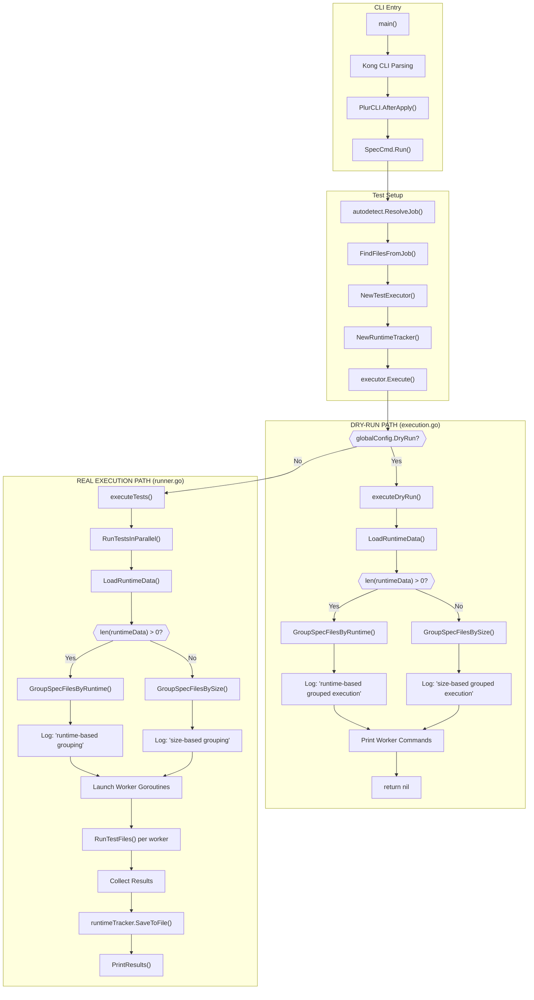

# Execution Paths Analysis

Analysis of duplicate code paths in plur's test execution flow.

## Summary

The plur codebase has **two separate code paths** that independently load runtime data and group test files:

* **Path A**: `executeDryRun()` in `execution.go` (for `--dry-run` flag)
* **Path B**: `RunTestsInParallel()` in `runner.go` (for real execution)

This creates:

* Duplicated logic (DRY violation)
* Inconsistent log messages
* Risk of the two paths diverging

## Architecture Diagram



## Call Graph

```
main()
  └─→ Kong CLI parsing
      └─→ PlurCLI.AfterApply()
      └─→ SpecCmd.Run()
          ├─→ autodetect.ResolveJob()
          ├─→ FindFilesFromJob()
          ├─→ NewTestExecutor()
          │   └─→ NewRuntimeTracker() [ALWAYS created, unused in dry-run]
          │
          └─→ TestExecutor.Execute()
              │
              ├─→ IF globalConfig.DryRun ────────────────────────────┐
              │   └─→ executeDryRun()                                │
              │       ├─→ LoadRuntimeData()        ◄── CALL #1       │
              │       ├─→ GroupSpecFilesByRuntime()                  │ PATH A
              │       │   OR GroupSpecFilesBySize()                  │
              │       ├─→ Log: "Using X-based grouped execution"     │
              │       └─→ Print commands, return                     │
              │                                                      │
              └─→ ELSE ──────────────────────────────────────────────┤
                  └─→ executeTests()                                 │
                      └─→ RunTestsInParallel()                       │
                          ├─→ LoadRuntimeData()    ◄── CALL #2       │ PATH B
                          ├─→ GroupSpecFilesByRuntime()              │
                          │   OR GroupSpecFilesBySize()              │
                          ├─→ Log: "Using X-based grouping"          │
                          ├─→ Launch workers, run tests              │
                          └─→ Collect results                        │
                                                                     │
                      └─→ runtimeTracker.SaveToFile()                │
                      └─→ PrintResults()                             ┘
```

## Duplication Points

### 1. Runtime Data Loading

| Location | File:Line | When Called |
|----------|-----------|-------------|
| CALL #1 | `execution.go:72` | `--dry-run` only |
| CALL #2 | `runner.go:268` | Real execution only |

Both call `LoadRuntimeData()` which reads `~/.plur/runtime/<project-hash>.json`.

### 2. Grouping Decision Logic

Both paths have identical if/else:

```go
// execution.go:79-85
if len(runtimeData) > 0 {
    groups = GroupSpecFilesByRuntime(testFiles, WorkerCount, runtimeData)
} else {
    groups = GroupSpecFilesBySize(testFiles, WorkerCount)
}

// runner.go:279-285
if len(runtimeData) > 0 {
    groups = GroupSpecFilesByRuntime(testFiles, maxWorkers, runtimeData)
} else {
    groups = GroupSpecFilesBySize(testFiles, maxWorkers)
}
```

### 3. Inconsistent Log Messages

| Path | Strategy | Message |
|------|----------|---------|
| Dry-run | Runtime | "Using runtime-based grouped execution" |
| Dry-run | Size | "Using size-based grouped execution" |
| Real | Runtime | "Using runtime-based grouping" |
| Real | Size | "Using size-based grouping (no runtime data available)" |

### 4. RuntimeTracker Creation

`NewTestExecutor()` always creates a `RuntimeTracker`, but `executeDryRun()` never uses it.

## Root Cause

The duplication happened because `executeDryRun()` was added as a **completely separate code path** rather than as a mode within the existing execution flow.

## Future Fix: Extract ExecutionPlan

The recommended fix is to extract a shared `ExecutionPlan` struct:

```go
type ExecutionPlan struct {
    Groups      []FileGroup
    RuntimeData map[string]float64
    Strategy    string // "runtime" or "size"
}

func BuildExecutionPlan(testFiles []string, workerCount int) (*ExecutionPlan, error) {
    // Single place for:
    // 1. Loading runtime data
    // 2. Grouping files
    // 3. Logging strategy
}
```

Then both `executeDryRun()` and `RunTestsInParallel()` would call this single function, eliminating the duplication.
