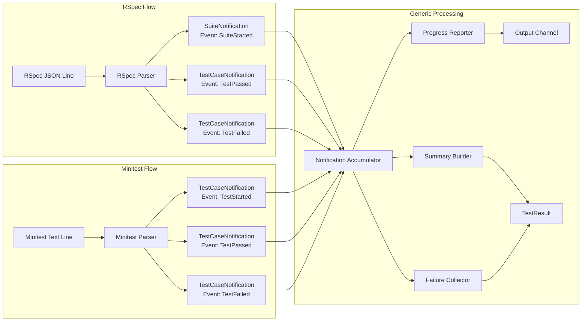

# Test Event Parser Example

This document shows concrete examples of how TestEvent and parsers would work for different frameworks.

## The Basic Flow

```
Raw Output Line → Parser → TestNotification(s) → Accumulator → Final Result
```

## Core Types

```go
// Event type enum - our internal representation
type TestEvent string

const (
    TestPassed    TestEvent = "test_passed"
    TestFailed    TestEvent = "test_failed"
    TestPending   TestEvent = "test_pending"
    TestStarted   TestEvent = "test_started"
    SuiteStarted  TestEvent = "suite_started"
    SuiteFinished TestEvent = "suite_finished"
    RawOutput     TestEvent = "raw_output"
)

// Interface that all notifications implement
type TestNotification interface {
    GetEvent() TestEvent
    GetTestID() string
}

// 1. For individual test cases (passed/failed/pending)
type TestCaseNotification struct {
    Event           TestEvent  // Our enum (TestPassed, TestFailed, etc.)
    TestID          string     // Unique identifier
    Description     string
    FullDescription string
    Location        string     // e.g. "./spec/foo_spec.rb:42"
    FilePath        string
    LineNumber      int
    Status          string     // Original status from framework ("passed", "failed", etc.)
    Duration        time.Duration
    
    // Only populated for failures
    Exception       *TestException
    
    // Only populated for pending tests
    PendingMessage  string
}

func (n TestCaseNotification) GetEvent() TestEvent { return n.Event }
func (n TestCaseNotification) GetTestID() string { return n.TestID }

type TestException struct {
    Class     string
    Message   string
    Backtrace []string
}

// 2. For suite-level events
type SuiteNotification struct {
    Event        TestEvent
    TestCount    int
    FailureCount int
    PendingCount int
    LoadTime     time.Duration
    Duration     time.Duration
}

func (n SuiteNotification) GetEvent() TestEvent { return n.Event }
func (n SuiteNotification) GetTestID() string { return "" } // Suite events don't have test IDs

// 3. For raw output that doesn't match patterns
type OutputNotification struct {
    Event   TestEvent // Always RawOutput
    Content string
}

func (n OutputNotification) GetEvent() TestEvent { return n.Event }
func (n OutputNotification) GetTestID() string { return "" }
```

## RSpec Example

### RSpec Output
```
Starting tests...
RUX_JSON:{"type":"load_summary","summary":{"count":10,"load_time":0.123}}
RUX_JSON:{"type":"example_passed","example":{"description":"adds numbers","full_description":"Calculator adds numbers","file_path":"./spec/calculator_spec.rb","line_number":5,"run_time":0.001}}
..
RUX_JSON:{"type":"example_failed","example":{"description":"divides by zero","full_description":"Calculator divides by zero","file_path":"./spec/calculator_spec.rb","line_number":10,"run_time":0.002,"exception":{"class":"ZeroDivisionError","message":"divided by 0","backtrace":["spec/calculator_spec.rb:11"]}}}
F
RUX_JSON:{"type":"dump_summary","duration":0.5,"example_count":10,"failure_count":1}
```

### RSpec Parser Implementation
```go
type RSpecOutputParser struct {
    testCounter int
}

func (p *RSpecOutputParser) ParseLine(line string) ([]TestNotification, bool) {
    notifications := []TestNotification{}
    
    // Check if it's a JSON line
    if strings.HasPrefix(line, "RUX_JSON:") {
        jsonStr := strings.TrimPrefix(line, "RUX_JSON:")
        
        var msg map[string]interface{}
        if err := json.Unmarshal([]byte(jsonStr), &msg); err != nil {
            return nil, false
        }
        
        msgType, _ := msg["type"].(string)
        
        switch msgType {
        case "load_summary":
            if summary, ok := msg["summary"].(map[string]interface{}); ok {
                count, _ := summary["count"].(float64)
                loadTime, _ := summary["load_time"].(float64)
                
                notifications = append(notifications, SuiteNotification{
                    Event:     SuiteStarted,
                    TestCount: int(count),
                    LoadTime:  time.Duration(loadTime * float64(time.Second)),
                })
            }
            
        case "example_passed", "example_failed", "example_pending":
            if example, ok := msg["example"].(map[string]interface{}); ok {
                desc, _ := example["description"].(string)
                fullDesc, _ := example["full_description"].(string)
                location, _ := example["location"].(string)
                filePath, _ := example["file_path"].(string)
                lineNum, _ := example["line_number"].(float64)
                runTime, _ := example["run_time"].(float64)
                status, _ := example["status"].(string)
                
                testID := location // Use location as testID since it's unique
                if testID == "" {
                    testID = fmt.Sprintf("%s:%d", filePath, int(lineNum))
                }
                
                // Map RSpec type to our TestEvent
                var event TestEvent
                switch msgType {
                case "example_passed":
                    event = TestPassed
                case "example_failed":
                    event = TestFailed
                case "example_pending":
                    event = TestPending
                }
                
                notification := TestCaseNotification{
                    Event:           event,
                    TestID:          testID,
                    Description:     desc,
                    FullDescription: fullDesc,
                    Location:        location,
                    FilePath:        filePath,
                    LineNumber:      int(lineNum),
                    Status:          status, // Keep original status
                    Duration:        time.Duration(runTime * float64(time.Second)),
                }
                
                // Handle failure details
                if msgType == "example_failed" {
                    if exception, ok := example["exception"].(map[string]interface{}); ok {
                        notification.Exception = &TestException{
                            Class:   getString(exception, "class"),
                            Message: getString(exception, "message"),
                        }
                        if backtrace, ok := exception["backtrace"].([]interface{}); ok {
                            for _, line := range backtrace {
                                if str, ok := line.(string); ok {
                                    notification.Exception.Backtrace = append(notification.Exception.Backtrace, str)
                                }
                            }
                        }
                    }
                }
                
                // Handle pending message
                if msgType == "example_pending" {
                    notification.PendingMessage = getString(example, "pending_message")
                }
                
                notifications = append(notifications, notification)
            }
            
        case "dump_summary":
            count := getInt(msg, "example_count")
            failures := getInt(msg, "failure_count")
            pending := getInt(msg, "pending_count")
            duration := getFloat(msg, "duration")
            
            notifications = append(notifications, SuiteNotification{
                Event:        SuiteFinished,
                TestCount:    count,
                FailureCount: failures,
                PendingCount: pending,
                Duration:     time.Duration(duration * float64(time.Second)),
            })
        }
        
        return notifications, true // Line was consumed
    }
    
    // Not a JSON line - return as raw output
    if line != "" {
        notifications = append(notifications, OutputNotification{
            Event:   RawOutput,
            Content: line,
        })
    }
    
    return notifications, false // Line was not consumed (should be kept in output)
}

// Helper functions
func getString(m map[string]interface{}, key string) string {
    if v, ok := m[key].(string); ok {
        return v
    }
    return ""
}

func getInt(m map[string]interface{}, key string) int {
    if v, ok := m[key].(float64); ok {
        return int(v)
    }
    return 0
}

func getFloat(m map[string]interface{}, key string) float64 {
    if v, ok := m[key].(float64); ok {
        return v
    }
    return 0
}
```

## Minitest Example

### Minitest Output
```
Run options: --seed 12345

# Running:

.in test_addition
..F

Failure:
CalculatorTest#test_division_by_zero [test/calculator_test.rb:15]:
Expected: Infinity
  Actual: Error

bin/rails test test/calculator_test.rb:15

.E

Error:
CalculatorTest#test_error_case [test/calculator_test.rb:20]:
RuntimeError: Something went wrong
    test/calculator_test.rb:21:in `test_error_case'

Finished in 0.123456s, 32.5203 runs/s, 40.6504 assertions/s.

4 runs, 5 assertions, 1 failures, 1 errors, 0 skips
```

### Minitest Parser Implementation
```go
type MinitestOutputParser struct {
    currentTest     string
    currentLocation string
    inFailure       bool
    failureBuffer   strings.Builder
    testCounter     int
}

func (p *MinitestOutputParser) ParseLine(line string) ([]TestNotification, bool) {
    notifications := []TestNotification{}
    
    // Check for test execution start
    if strings.Contains(line, "in test_") {
        if match := regexp.MustCompile(`in (test_\w+)`).FindStringSubmatch(line); match != nil {
            p.currentTest = match[1]
            notifications = append(notifications, TestCaseNotification{
                Event:       TestStarted,
                TestID:      p.currentTest,
                Description: p.currentTest,
                Status:      "running",
            })
        }
    }
    
    // Check for progress indicators
    for _, char := range line {
        switch char {
        case '.':
            p.testCounter++
            testID := p.currentTest
            if testID == "" {
                testID = fmt.Sprintf("test_%d", p.testCounter)
            }
            
            notifications = append(notifications, TestCaseNotification{
                Event:       TestPassed,
                TestID:      testID,
                Description: testID,
                Status:      "passed",
                Location:    p.currentLocation,
            })
            
        case 'F':
            p.testCounter++
            p.inFailure = true
            p.failureBuffer.Reset()
            
        case 'E':
            p.testCounter++
            p.inFailure = true
            p.failureBuffer.Reset()
        }
    }
    
    // Handle failure details
    if p.inFailure {
        p.failureBuffer.WriteString(line + "\n")
        
        // Check if we've captured the whole failure
        if line == "" || strings.HasPrefix(line, "bin/rails test") {
            // Parse the failure
            failureText := p.failureBuffer.String()
            
            // Extract test name and location
            if match := regexp.MustCompile(`(\w+Test)#(test_\w+) \[(.+):(\d+)\]`).FindStringSubmatch(failureText); match != nil {
                className := match[1]
                testName := match[2]
                filePath := match[3]
                lineNum, _ := strconv.Atoi(match[4])
                location := fmt.Sprintf("%s:%d", filePath, lineNum)
                
                notification := TestCaseNotification{
                    Event:           TestFailed,
                    TestID:          location,
                    Description:     testName,
                    FullDescription: fmt.Sprintf("%s#%s", className, testName),
                    Location:        location,
                    FilePath:        filePath,
                    LineNumber:      lineNum,
                    Status:          "failed",
                    Exception: &TestException{
                        Message: failureText,
                    },
                }
                
                // Try to extract exception class from error messages
                if strings.Contains(failureText, "Error:") {
                    if errorMatch := regexp.MustCompile(`(\w+Error):`).FindStringSubmatch(failureText); errorMatch != nil {
                        notification.Exception.Class = errorMatch[1]
                    }
                }
                
                notifications = append(notifications, notification)
            }
            
            p.inFailure = false
        }
    }
    
    // Check for summary line
    if match := regexp.MustCompile(`(\d+) runs?, (\d+) assertions?, (\d+) failures?, (\d+) errors?, (\d+) skips?`).FindStringSubmatch(line); match != nil {
        runs, _ := strconv.Atoi(match[1])
        failures, _ := strconv.Atoi(match[3])
        errors, _ := strconv.Atoi(match[4])
        skips, _ := strconv.Atoi(match[5])
        
        notifications = append(notifications, SuiteNotification{
            Event:        SuiteFinished,
            TestCount:    runs,
            FailureCount: failures + errors,
            PendingCount: skips,
        })
    }
    
    // Check for duration line
    if match := regexp.MustCompile(`Finished in (\d+\.\d+)s`).FindStringSubmatch(line); match != nil {
        if duration, err := strconv.ParseFloat(match[1], 64); err == nil {
            // Could enhance SuiteNotification with this info
        }
    }
    
    return notifications, false // Minitest output is always preserved
}
```

## How Events Flow Through the System



## Usage in Runner

```go
func RunTestFiles(ctx context.Context, config *Config, files []string, 
                  workerIndex int, outputChan chan<- OutputMessage) TestResult {
    
    // Get parser for the framework
    var parser TestOutputParser
    switch config.Framework {
    case FrameworkRSpec:
        parser = &RSpecOutputParser{}
    case FrameworkMinitest:
        parser = &MinitestOutputParser{}
    }
    
    // Create accumulator
    accumulator := NewNotificationAccumulator()
    
    // ... setup command and pipes ...
    
    // Process output
    scanner := bufio.NewScanner(stdout)
    var outputBuilder strings.Builder
    
    for scanner.Scan() {
        line := scanner.Text()
        
        // Parse line into notifications
        notifications, consumed := parser.ParseLine(line)
        
        // Process each notification
        for _, notification := range notifications {
            accumulator.AddNotification(notification)
            
            // Send progress updates based on event type
            switch notification.GetEvent() {
            case TestPassed:
                outputChan <- OutputMessage{
                    WorkerID: workerIndex,
                    Type:     "dot",
                }
            case TestFailed:
                outputChan <- OutputMessage{
                    WorkerID: workerIndex,
                    Type:     "failure",
                }
            case TestPending:
                outputChan <- OutputMessage{
                    WorkerID: workerIndex,
                    Type:     "pending",
                }
            }
        }
        
        // Keep raw output if not consumed
        if !consumed {
            outputBuilder.WriteString(line + "\n")
        }
    }
    
    // Build final result
    return TestResult{
        File:         testFile,
        State:        determineState(accumulator, err),
        Output:       outputBuilder.String(),
        Duration:     time.Since(start),
        Failures:     accumulator.GetFailures(),
        ExampleCount: accumulator.GetTestCount(),
        FailureCount: accumulator.GetFailureCount(),
    }
}
```

## Type Mappings

### RSpec Type → TestEvent Mapping
- `"example_passed"` → `TestPassed` event (but keeps `status: "passed"`)
- `"example_failed"` → `TestFailed` event (but keeps `status: "failed"`)  
- `"example_pending"` → `TestPending` event (but keeps `status: "pending"`)
- `"load_summary"` → `SuiteStarted` event
- `"dump_summary"` → `SuiteFinished` event

### Key Distinction
- **Event** (TestEvent): Our internal event type for routing/handling
- **Status** (string): The original test status from the framework
- They serve different purposes and both are preserved

## Key Benefits

1. **Single Responsibility**: Parsers only parse, they don't accumulate or format
2. **Framework Agnostic Notifications**: The same notification types work for all frameworks
3. **Testable**: Can test parsers with sample output strings
4. **Extensible**: Adding a new framework means writing a new parser
5. **Progress Reporting**: Generic - any `TestPassed` event shows a dot
6. **Rich Data**: We preserve all the data (location, status, etc.) from the framework

## The Magic

The parser acts as a **translator** between framework-specific output and generic notifications. The rest of the system doesn't care if the test framework outputs JSON, XML, or plain text - it only sees standardized `TestNotification` objects with consistent interfaces.