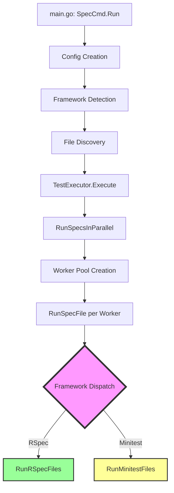
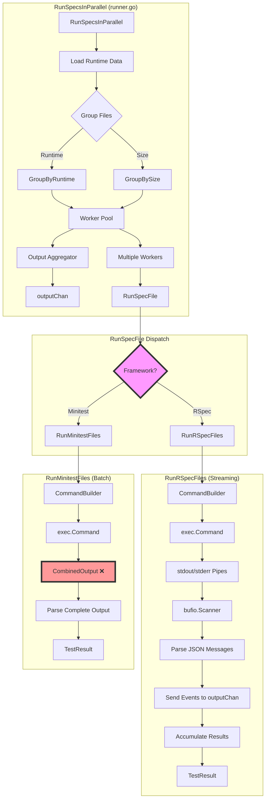
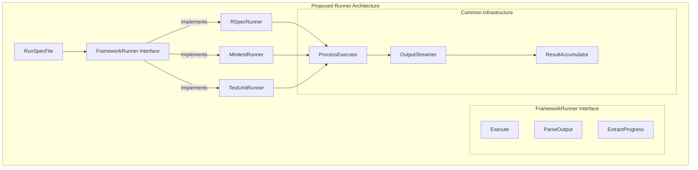

# Test Execution Design

This document outlines the test execution flow in rux, from the CLI entry point through to the framework-specific runners. The goal is to identify where responsibilities should be divided to make adding new frameworks easier.

## High-Level Execution Flow



## Detailed Runner Architecture



## Key Components and Responsibilities

### 1. Main Entry Point (`main.go`)
- **Current**: Handles CLI parsing, framework detection, config creation
- **Responsibility**: CLI interface and initial setup
- **Good**: Clean separation from execution logic

### 2. Test Executor (`execution.go`)
- **Current**: Orchestrates test execution, handles dry-run
- **Responsibility**: High-level execution flow
- **Good**: Framework-agnostic orchestration

### 3. File Discovery (`glob.go`)
- **Current**: Framework-aware file finding
- **Responsibility**: Finding test files based on framework
- **Good**: Already abstracted per framework

### 4. Command Building
- **Current**: CommandBuilder interface with framework implementations
- **Responsibility**: Building framework-specific commands
- **Good**: Well abstracted with interface pattern

### 5. Runner (`runner.go`) - **PROBLEM AREA**
- **Current Issues**:
  - `RunSpecFile` does simple dispatch but implementations are very different
  - `RunRSpecFiles` has sophisticated streaming/parsing
  - `RunMinitestFiles` uses simple batch execution
  - Too much framework-specific logic embedded in runner

## Current Problems

1. **Asymmetric Implementations**:
   - RSpec: Streaming JSON parser with real-time progress
   - Minitest: Batch execution with post-processing
   - Different output handling approaches

2. **Mixed Responsibilities in Runner**:
   - Process management (pipes, command execution)
   - Output parsing (JSON for RSpec, text for Minitest)
   - Progress reporting (OutputMessage events)
   - Result accumulation

3. **Hard to Add New Frameworks**:
   - Need to understand complex streaming logic
   - Must handle both progress and final results
   - Different output formats require different parsing

## Proposed Abstraction



## Proposed Refactoring

### 1. Create FrameworkRunner Interface
```go
type FrameworkRunner interface {
    // Execute runs the test command and returns results
    Execute(ctx context.Context, config *Config, files []string, 
            workerIndex int, outputChan chan<- OutputMessage) TestResult
    
    // ParseProgress extracts progress indicators from a line of output
    ParseProgress(line string) []ProgressEvent
    
    // ParseSummary extracts final summary from complete output
    ParseSummary(output string) TestSummary
}
```

### 2. Extract Common Process Execution
```go
type ProcessExecutor struct {
    command     []string
    env         []string
    outputChan  chan<- OutputMessage
    progressParser func(string) []ProgressEvent
}

func (p *ProcessExecutor) Execute(ctx context.Context) (string, error) {
    // Common pipe setup
    // Common streaming logic
    // Calls progressParser for each line
    // Returns accumulated output
}
```

### 3. Framework-Specific Runners
```go
type RSpecRunner struct {
    formatter string
}

func (r *RSpecRunner) Execute(...) TestResult {
    executor := &ProcessExecutor{
        progressParser: r.parseRSpecProgress,
    }
    output, err := executor.Execute(ctx)
    return r.buildResult(output, err)
}

type MinitestRunner struct{}

func (m *MinitestRunner) Execute(...) TestResult {
    executor := &ProcessExecutor{
        progressParser: m.parseMinitestProgress,
    }
    output, err := executor.Execute(ctx)
    return m.buildResult(output, err)
}
```

## Benefits of This Design

1. **Clear Separation of Concerns**:
   - Process execution is separate from output parsing
   - Framework-specific logic is isolated
   - Common patterns are reused

2. **Easier to Add Frameworks**:
   - Implement FrameworkRunner interface
   - Define progress parsing rules
   - Reuse common infrastructure

3. **Consistent Behavior**:
   - All frameworks get streaming output
   - All frameworks get progress reporting
   - Standardized error handling

4. **Testability**:
   - Can test parsing logic separately
   - Can mock process execution
   - Clear interfaces to test against

## Migration Path

1. **Phase 1**: Fix Minitest streaming (immediate need)
   - Update `RunMinitestFiles` to use pipes like RSpec
   - Add progress parsing for minitest output

2. **Phase 2**: Extract ProcessExecutor
   - Move common pipe/streaming logic
   - Keep existing functions but use ProcessExecutor internally

3. **Phase 3**: Create FrameworkRunner interface
   - Implement for RSpec and Minitest
   - Update RunSpecFile to use interface

4. **Phase 4**: Add new frameworks
   - TestUnit, Cucumber, etc.
   - Just implement FrameworkRunner

## Key Insight

The core issue is that we're mixing **process management** (how to run commands and capture output) with **output interpretation** (what the output means). By separating these concerns, we can:

1. Reuse process management across all frameworks
2. Make framework-specific logic pluggable
3. Ensure consistent user experience (progress dots, colors, etc.)
4. Make the codebase more maintainable and testable